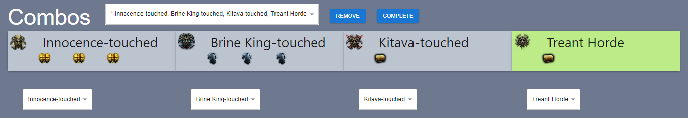
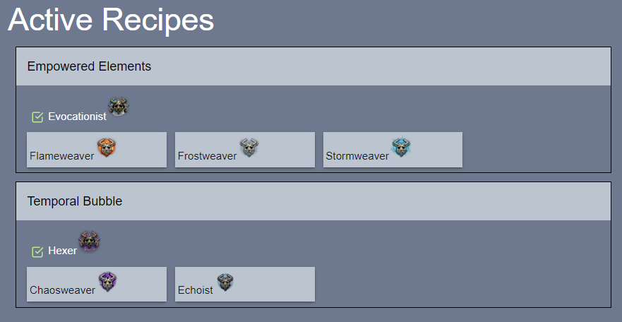
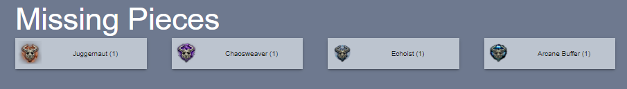
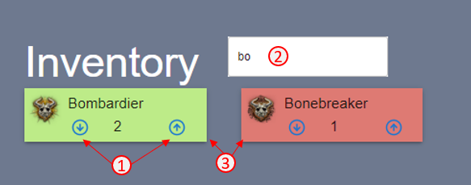

# PoE Archnemesis Tracker

This simple React website is used to keep track of the monster recipes for the [Archnemesis League](https://www.pathofexile.com/siege) in [Path of Exile](https://www.pathofexile.com/).

The challenge of this league was to collect a number of unique monster types and use them in [recipes](https://www.poewiki.net/wiki/List_of_Archnemesis_modifiers_in_Archnemesis_league) to upgrade and recieve rewards.

The difficulty with this involved keeping track of your collected monsters and knowing which recipes you had available and which you should do to work towards your ultimate goal.

## Features

- Keep track of your collected monster types
- Select recipe goals to work towards
- Show which monsters you are missing
- Indicate which recipes to do in order to get to higher level recipes


# Setup

## Prerequisites

- [Node JS](https://nodejs.org) (with `npm`)

## Initial Setup

Once you have checked out this repository you should install the required dependencies using npm. 
Run this command in the `root` directory:

```
npm install
```

## Running the dev server

The easiest way to run the server is to execute the following command in the the `root` directory:

```
npm start
```

# Usage

## Combos

In the Combos section, you can select the four Archnemesis recipes you are trying to create for your ultimate combo.

You can select and change each monster using the dropdown menu beneath the monster's tile.

Monster recipes that you have fully completed are shown in green.

There is another dropdown at the top of this section that allows you to create multiple combos to work towards.

Any combo that is able to be completed with the current monsters in your inventory is marked with an asterisk (`*`).




## Active Recipes

The active recipes section shows recipes that are possible to do with the current monsters in your inventory.

Only recipes that are relevant to the currently selected Combo will be shown.

Clicking on the green check box will complete this recipe.

Completing the recipe will add one of the resulting monster to your inventory and remove one of each component.



## Missing Pieces

The missing pieces list shows which monsters you still need and the amount required to do your current combo.

Clicking on monster tile will add it to your inventory.




## Monster Inventory

1. Add or remove monsters from your inventory with the up and down arrows in the Inventory section.

2. Search for specific monster names.

3. The background color indicates the monster's usefulness. Green means the monster is used in current recipes. Red means the monster is not used and can be discarded.


