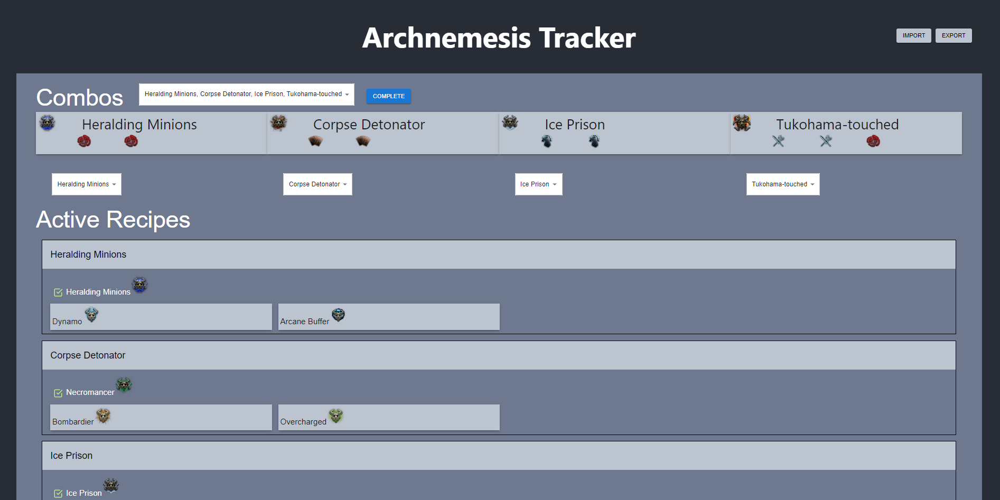
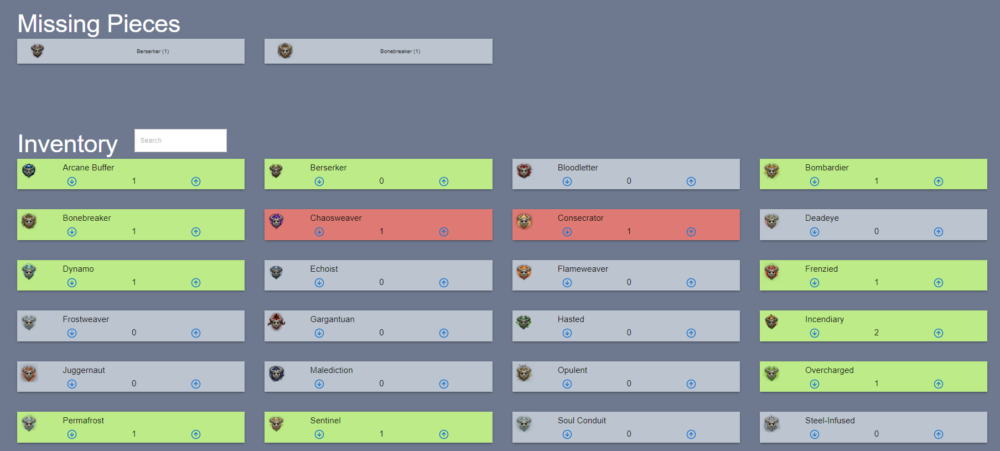

# PoE Archnemesis Tracker

This simple React website is used to keep track of the monster recipes for the [Archnemesis League](https://www.pathofexile.com/siege) in [Path of Exile](https://www.pathofexile.com/).

The challenge of this league was to collect a number of unique monster types and use them in [recipes](https://www.poewiki.net/wiki/List_of_Archnemesis_modifiers_in_Archnemesis_league) to upgrade and recieve rewards.

The difficulty with this involved keeping track of your collected monsters and knowing which recipes you had available and which you should do to work towards your ultimate goal.

## Features

- Keep track of your collected monster types
- Select recipe goals to work towards
- Show which monsters you are missing
- Indicate which recipes to do in order to get to higher level recipes




# Setup

## Prerequisites

- [Node JS](https://nodejs.org) (with `npm`)

## Initial Setup

Once you have checked out this repository you should install the required dependencies using npm. 
Run this command in the `root` directory:

```
npm install
```

## Running the dev server

The easiest way to run the server is to execute the following command in the the `root` directory:

```
npm start
```

# Usage

